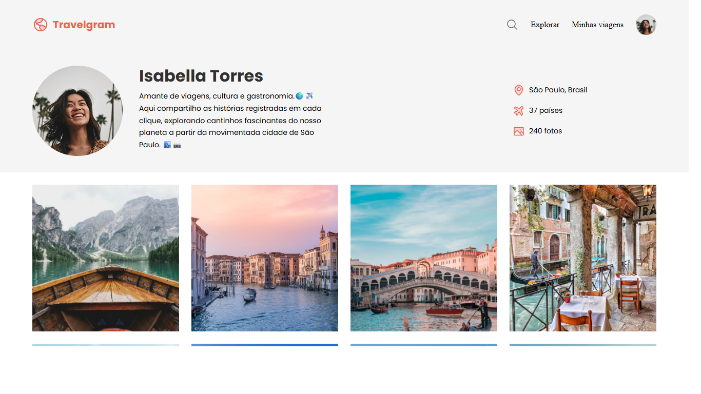

# Travelgram — Perfil de Viagens

Uma página estática de perfil de viagens com galeria de fotos em grade, cabeçalho com navegação, seção de perfil e rodapé. Construído com HTML5 e CSS modular.

## Preview

> Abra o arquivo `index.html` no navegador para ver ao vivo.



## Tecnologias

- HTML5 sem dependências de JS
- CSS3 modular (arquivos separados por área)
- Google Fonts (Poppins 400/700)

## Estrutura do Projeto

```
projeto-travelgram/
├─ index.html
├─ assets/
│  ├─ icons/
│  └─ images/
└─ styles/
   ├─ footer.css
   ├─ global.css
   ├─ header.css
   ├─ index.css
   ├─ main.css
   └─ nav.css
```

Os estilos são centralizados em `styles/index.css`, que importa os demais módulos (`global`, `nav`, `header`, `main`, `footer`).

## Como Executar Localmente

- Método rápido: clique duas vezes em `index.html` para abrir no seu navegador.
- Com Live Server (recomendado no VS Code):
  1. Abra a pasta no VS Code.
  2. Instale e ative a extensão "Live Server".
  3. Clique em "Go Live" (ou botão semelhante) para servir o projeto em `http://127.0.0.1:5500/`.

## Personalização Rápida

- Perfil (nome, bio e contadores): edite a seção `<header>` dentro de `index.html`.
- Galeria de fotos: no `<main>` de `index.html`, adicione novas imagens seguindo o padrão:

```html
<main class="container">
  
</main>
```

## Notas de Design

- Tipografia: Poppins (400 e 700) via Google Fonts já importada em `index.html`.
- Layout: container centralizado, navbar com logo e ações, cabeçalho com bloco de perfil e lista de informações, galeria de imagens em grade e rodapé simples.

## Roadmap (ideias)

- Filtro/pesquisa de destinos (requer JS)
- Modal de visualização de fotos
- Tema claro/escuro via CSS
